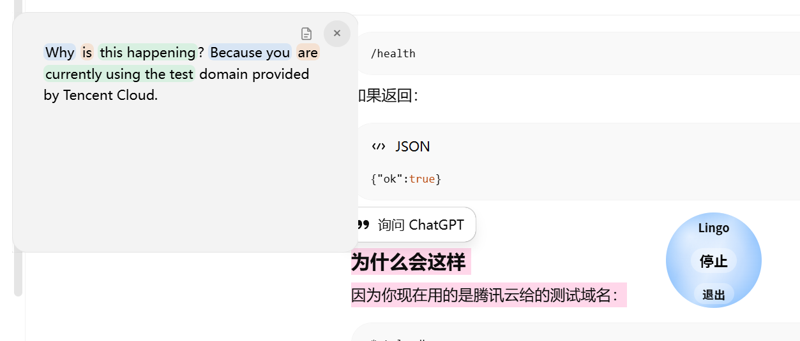

# Minimalist Translation

一款 Windows 桌面划词翻译工具，支持悬浮窗翻译、单词查询和英语语法辅助变色。

## 下载

请到右侧 **Releases** 下载最新版：

Minimalist Translation v0.1.0

## 使用方式

1. 下载压缩包
2. 解压到任意文件夹
3. 双击程序启动
4. 启动后划取文字，即可弹出翻译悬浮窗

## 功能

- 划词翻译
- 悬浮窗显示译文
- 英文单词点击查询
- 英语主谓宾/主系表辅助变色
- 支持中英互译

## 注意

- 当前为测试版
- 仅支持 Windows
- Windows 可能提示未知发布者，选择“仍要运行”即可
- 请勿删除解压后的内部文件，否则程序可能无法启动

## 反馈

如果遇到问题，可以在 Issues 中反馈。
## 预览

